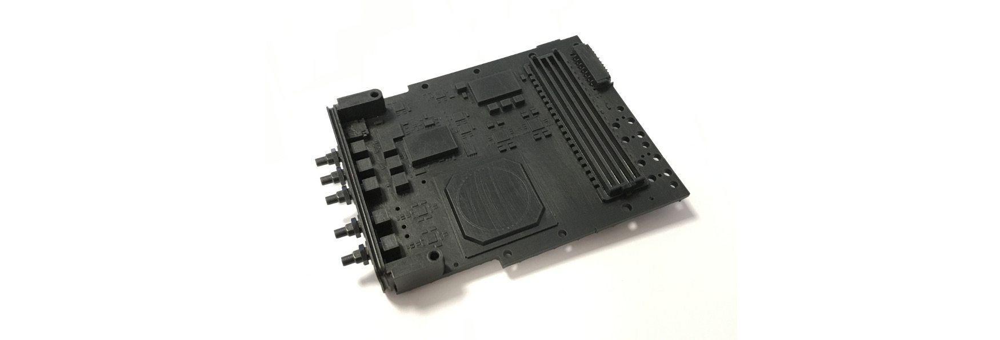

# FMC applications on MicroTCA® platform

This repository is a place where existing users of FMC (FPGA Mezzanine Card)
platform can share their experience with FMC hardware, firmware and software.
The goal is to provide useful information to new users.

The main feature of this repository is a list of FMC carriers. From there one
can find different FMC mezzanines and applications developed on top of the
specific FMC carrier.

Contributions from companies providing FMC carriers are also highly appreciated.
Please see [Contributing](#contributing)

This repository is moderated by [MicroTCA Technology Lab](https://techlab.desy.de)
at [DESY](https://www.desy.de).

## List of the carriers

  - [AFC](carriers/afc/afc.md)
  - [DESY DAMC-FMC20](carriers/damc-fmc20/damc-fmc20.md)
  - [DESY DAMC-FMC25](carriers/damc-fmc25/damc-fmc25.md)
  - ...

## Contributing

### Adding a new FMC carrier

To add a new carrier to this repository:

  - Fork this repository and create a new branch
  - Create a new folder with the carrier name in the `carriers` folder
  - Create a `.md` with the carrier name in the previously created folder.
  - Add some basic information (main features, link to product page, ...)
  - Commit the changes
  - Create a pull request

### Adding a new FMC mezzanine/application

To add a new FMC mezzanine or an application using the mezzanine:

  - Fork this repository and create a new branch
  - Add your description of the mezzanine/application to the corresponding
    carrier. Feel free to provide links to product page, firmware and software
    components. Nice photos are also very much appreciated.
  - Commit the changes
  - Create a pull request

## Disclaimer

The information on this site is provided "AS IS" and without warranties of any
kind either express or implied.

*MicroTCA and the µTCA are trademarks of PICMG. All registered trademarks are 
the property of their respective owners.* 
