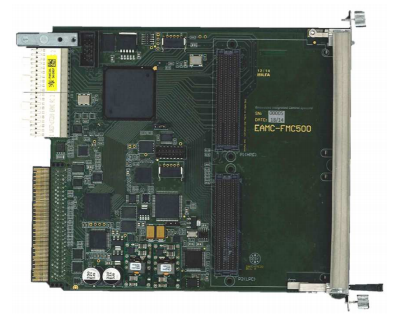

# DAMC-FMC20

Designed by: DESY

Commercially available: CAEN ELS

FPGA: Xilinx Spartan-6

Description:

The DAMC-FMC20 is a cost-efficient FPGA mezzanine card (FMC) carrier designed
according to MicroTCA.4. It is equipped with two Spartan-6 FPGAs.

The carrier simultaneously supports one low pin count and one high pin count FMC
module. One FPGA allows serial high-speed communication (PCIe, RTM, Backplane,
FMCs). The other FPGA allows implementing large signal processing algorithms.
The carrier supports one serial link (GTP) for each FMC module and in addition
an extra 12V power connector for high current FMC applications. It provides one
PCIe link that is AMC.1 type 1 compliant. The carrier is softwarereconfigurable
over PCIe and MMC. The AMC ports 12-15 are connected via cross-point switch to
the FPGA.

## Mezzanines

### DFMC-MD22

Firmware is available at DESY.

Software library (using ChimeraTK framework):
[MotorDriverCard](https://github.com/ChimeraTK/MotorDriverCard)
