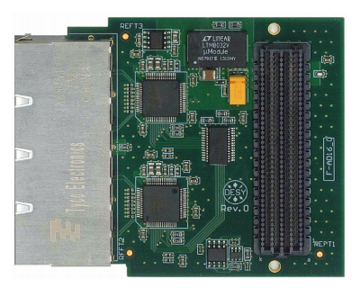

# DAMC-FMC25

Designed by: DESY

Commercially available: CAEN ELS

FPGA: Xilinx Virtex-5, Xilinx Spartan-6

Description:

DAMC-FMC25 is a general purpose carrier board with the ability to
host two FPGA Mezzanine Cards (FMC) with High Pin Count (HPC) connectors. The
AMC board is designed as a double-width mid-size MTCA.4 carrier.

A Virtex-5 FPGA allows to perform high demanding computations with a high data
throughput between FMCs, uRTM and PCI express on the MTCA backplane. Standard
version of the board mounts a Virtex-5 XC5VFX70T (1136-pin) and a Spartan
XC6SLX45T (484-pin) FPGAs provided respectively with 256 MB and 128 MB DDR2
memories. The local DDR2 memories can be used in order to store data that cannot
or does not need to be sent via PCI-e during acquisition.

## Mezzanines

### DFMC-AD16

The DFMC-AD16 is a cost-efficient FPGA mezzanine card (FMC) designed close to
ANSI/VITA 75.1. It offers sixteen input channels that can be operated in
single-ended mode or in differential mode (mode determined by populated ADC
chip). The card can accept +/-5V or +/-10V input voltages (selected via
software)

The card is designed for low-speed monitoring applications with 23 kHz input
bandwidth that can be sampled at up to 200kSPS.

The board contains digital circuits such as FRU EEPROM, Unique ID serial number
and a 12 bit temperature sensor. It contains level translators to accept any FMC
Voltage (Vadj) from 1.2 to 3.3V so that the board will fit into many different
FMC carriers.

Firmware is available at DESY.

Software library (using ChimeraTK framework):
[AD16](https://github.com/ChimeraTK/AD16)

### DFMC-4SFP+

Note: DAMC-FMC25 provides only 4 transceivers to both FMC slots, in two
possible configurations: 2/2 (each FMC slots gets 2 transceivers) of 4/0
(top FMC slot gets all 4 transceivers).

